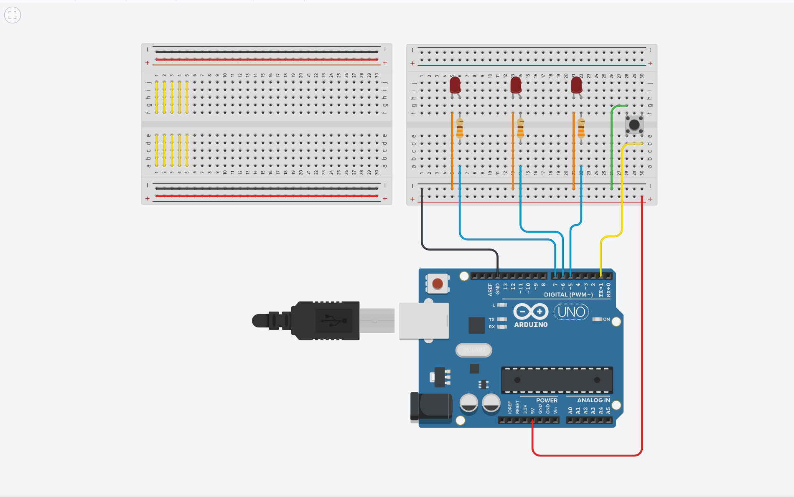

# Welcome to the App Robotics Arduino Introduction



```cpp
// Macros - act like constant variables (cannot be changed).
// The compiler will replace these in the code with their values.
#define LEDL 7
#define LEDC 6
#define LEDR 5

#define BTN 1

// btn should be true if the button is pressed and false otherwise
bool btn = false;
// btnAck should be the same value as btn AFTER the code has run one cycle
// this will allow us to only run code once when the button is pressed or
// released instead of constantly.
bool btnAck = false;

void setup()
{
  pinMode(LEDR, OUTPUT);
  pinMode(LEDC, OUTPUT);
  pinMode(LEDL, OUTPUT);
  pinMode(BTN, INPUT_PULLUP);
}

void loop()
{
  // Update btnAck to be the value of btn
  btnAck = btn;
  // Set btn to true if the button is currently being pressed
  btn = !digitalRead(BTN);
  
  // If the button is pressed AND btnAck has not been updated
  if (btn && !btnAck) {
  	digitalWrite(LEDR, HIGH);
    delay(1000);
  	digitalWrite(LEDC, HIGH);
    delay(1000);
  	digitalWrite(LEDL, HIGH);
  }
  // Else If the button is NOT pressed AND btnAck has not been updated
  else if (!btn && btnAck) {
    digitalWrite(LEDR, LOW);
	delay(1000);
    digitalWrite(LEDC, LOW);
    delay(1000);
    digitalWrite(LEDL, LOW);
  }
  
}

```


